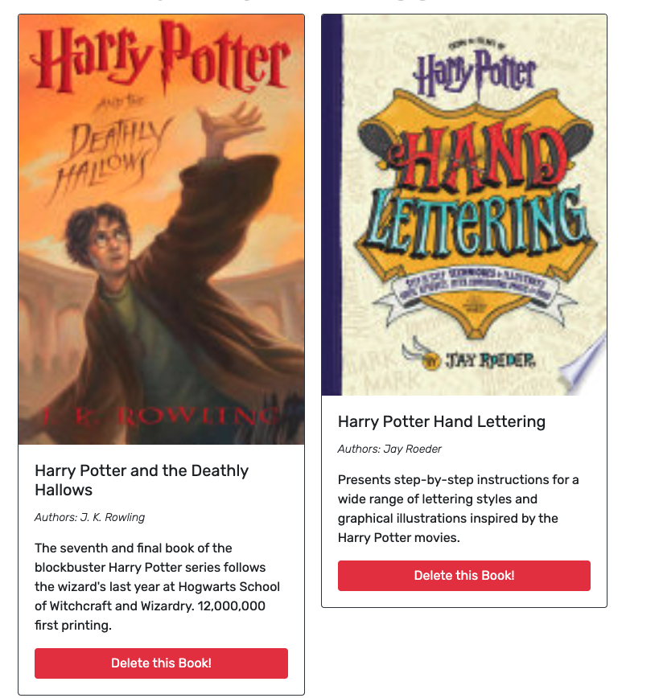

# Book-Search-Engine

## Table of Content 

- [Description](#description)
- [Visuals](#visuals)
- [Resources](#resources)
- [Authors and Acknowledgement](#authors-and-acknowledgement)

## Description 

This is a search book engine. This was a refactoring assignment, where I refactor this web application to meet the GraphQL requirement and/or standards. This web application allow a user to search for a book and saved that book to the saved pages. User is can only interact with the web application when they either login or sign up. 

## Visuals 

This is the home page / search for books page

This is what the page look like when searching for a book, user is allow to save the book if login

This is what the saved page look like when you save your books, use ia allow to delete book from saved pages

## Resources 

- [Github Repo](https://github.com/VanessaLiaw021/book-search-engine)

- [Live Site]()

## Authors and Acknowledgement 

Coded by Bootcamp Programmers 

Refactor the code to meet GraphQL requirement and standard by Vanessa Liaw